# Movie Rating App

| Log In                                                     | Movies                                                          | TV Shows                                                         |
| ---------------------------------------------------------- | --------------------------------------------------------------- | ---------------------------------------------------------------- |
| 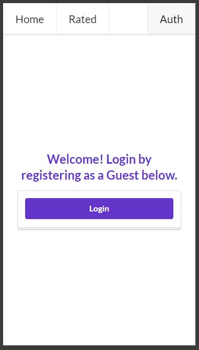 | 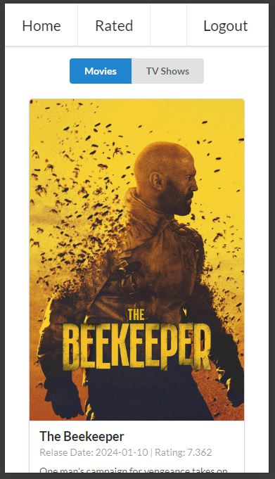 | 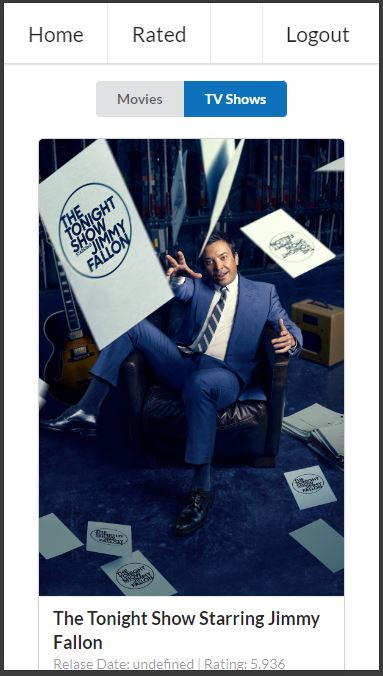 |

| Rated Movie                                                           | Movie Details                                                                | TV Rated TV Show                                                       |
| --------------------------------------------------------------------- | ---------------------------------------------------------------------------- | ---------------------------------------------------------------------- |
| 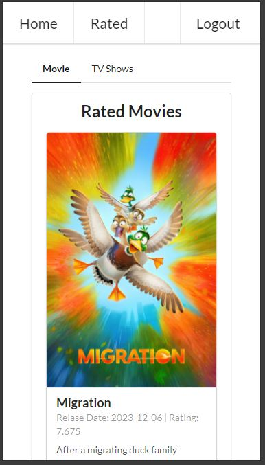 | 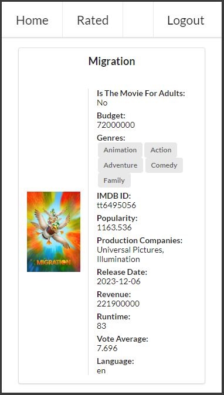 | 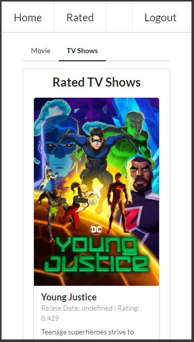 |

### Table of Contents

1. [Overview](#overview)
2. [Features](#features)
3. [Developed Using](#developed-using)
4. [How Vite, React, and TypeScript Are Used In The Application](#how-vite-react-and-typescript-are-used-in-the-application)
5. [How To Use The Program](#how-to-use-the-program)

### Overview

The Movie Rating App is a comprehensive web application that empowers users to discover and rate their favorite movies and TV shows. Built with a seamless integration with The Movie Database (TMDB) API, the app provides users with up-to-date information on an extensive library of titles, including current releases, popular picks, and timeless classics.

### Features:

- **Discover and Rate**: Explore a diverse collection of movies and TV shows, from blockbuster hits to indie gems. Users can rate titles based on their viewing experience, providing valuable feedback to the community and helping others discover new favorites.

- **Personalized Ratings and History**: The app stores user ratings, allowing users to track their preferences and revisit titles they've rated in the past. A dedicated page displays all rated movies and TV shows, enabling users to easily reference their ratings and recommendations.

- **Detailed Title Pages**: Clicking on a movie or TV show reveals a detailed page showcasing essential information such as budget, genres, popularity, production companies, release date, revenue, and runtime for movies, while TV shows display information like creators, episode runtime, genres, first air date, networks, production companies, number of episodes, and number of seasons.

- **Responsive Design**: The app is optimized for all devices, ensuring a seamless and consistent experience whether users are browsing on desktops, tablets, or mobile phones. The intuitive interface makes it easy to navigate and explore titles on any screen size.

- **Efficient Backend Integration**: Leveraging modern backend technologies, the app seamlessly integrates with the TMDb API to fetch real-time data on movies and TV shows. This ensures users have access to the latest information and a reliable browsing experience.

- **Guest Sessions**: The app provides a seamless experience for users without requiring them to create an account. Guest sessions allow users to rate content and access personalized recommendations without the need for registration.

### Developed Using:


### How Vite, React, and TypeScript Are Used In The Application

1. **Vite Usage**: Vite is used as the build tool for the frontend application. It provides fast and efficient bundling and hot module replacement (HMR), allowing for quick development and rapid feedback loops. Vite is responsible for building the React components, managing dependencies, and optimizing the application for production.
   <br/>

2. **React Usage**: React is used extensively throughout the application. Some examples of React usage are seen in the `navbar.tsx` file. It is used to define the UI components and manage the application's state and behavior. The `Navbar` component itself is a React functional component. Within the component, React elements such as `Menu`, `Menu.Item`, and `Menu.Menu` are used to structure the navigation bar's layout and functionality. React hooks like `useNavigate` and `useState` are also utilized to manage navigation and state changes within the component.

```jsx
import React from "react"; // Import React library
import { Button, Menu } from "semantic-ui-react"; // Import UI components from Semantic UI React
import { Link, useNavigate } from "react-router-dom"; // Import routing-related hooks from React Router DOM

export const Navbar = () => {
  const isLoggedIn = localStorage.getItem("guest_session_id") !== null; // Check if user is logged in
  const navigate = useNavigate(); // Initialize navigate function for programmatic navigation

  const logout = () => {
    localStorage.removeItem("guest_session_id"); // Remove guest session ID from local storage
    navigate("/auth"); // Redirect user to authentication page
  };

  return (
    <Menu fixed="top" size="huge">
      {" "}
      {/* Define a top-fixed menu */}
      {/* Navigation links */}
      <Menu.Item as={Link} to="/" style={{ fontSize: "1.5rem" }}>
        Home
      </Menu.Item>
      <Menu.Item as={Link} to="/rated" style={{ fontSize: "1.5rem" }}>
        Rated
      </Menu.Item>
      {/* Conditional rendering based on user authentication status */}
      <Menu.Menu position="right">
        {isLoggedIn ? (
          // Render logout button if user is logged in
          <Menu.Item
            as={Button}
            style={{ fontSize: "1.5rem" }}
            onClick={logout}
          >
            Logout
          </Menu.Item>
        ) : (
          // Render authentication link if user is not logged in
          <Menu.Item as={Link} to="/auth" style={{ fontSize: "1.5rem" }}>
            Auth
          </Menu.Item>
        )}
      </Menu.Menu>
    </Menu>
  );
};
```

- **Functional Component**: The `Navbar` component is defined as a functional component using the arrow function syntax. This is a React-specific way to define components.

- **JSX Syntax**: Within the `return` statement, JSX syntax is used to define the UI elements. JSX is a syntax extension for JavaScript often used with React to describe what the UI should look like.

- **Conditional Rendering**: React's ability for conditional rendering is utilized to conditionally render either the "Logout" button or the "Auth" link based on the `isLoggedIn` state variable.

- **React Router Integration**: The `Link` component from React Router DOM is used to create navigation links. The `useNavigate` hook is also used to programmatically navigate the user to different routes upon certain actions.

3. **TypeScript Usage**: TypeScript is a superset of JavaScript that adds static typing and other advanced features to the language. In the app, TypeScript is used to write type-safe code, catch errors at compile-time, and improve code maintainability and readability. TypeScript is used to define types for the React components, API responses, state management, and other parts of the application, ensuring robustness and reliability throughout the development process. In the code below, TypeScript is used to define the types of variables and function return values. For example, `data`, `isLoading`, and `seasonsPanels` are annotated with types inferred from the return values of `useQuery` hook and the `fetchTvShowDetails` function.

```jsx
import { useQuery } from "@tanstack/react-query";
import { useParams } from "react-router-dom";

export const TvShow = () => {
    const { id } = useParams<string>();

    if (!id) {
        return <div>Invalied Tv Show ID</div>;
    }

    const { data, isLoading } = useQuery({
        queryKey: ["tvShow"],
        queryFn: () => fetchTvShowDetails(id),
    });

    // Other code...
};
```

- TypeScript is used to import `useQuery` from the `@tanstack/react-query` package and `useParams` from the `react-router-dom`.
- The `useParams` hook is used to extract the id parameter from the URL path, and TypeScript is used to annotate the type of `id` as a `string`.
- TypeScript is used to define the type of the `data` and `isLoading` variables returned by the `useQuery` hook. These types are inferred based on the return type of the `useQuery` hook.
  TypeScript is used in the conditional check to ensure that the `id` is valid before proceeding with the API call.
  TypeScript is used to annotate the types of parameters passed to the `useQuery` hook, such as the `queryKey` array and the `queryFn` function.

Together, Vite, React, and TypeScript form a powerful stack for building modern web applications. Vite provides a fast and efficient development environment, React offers a declarative and component-based approach to building UIs, and TypeScript adds static typing and other language features to enhance developer productivity and code quality.
<br/>

### How To Use The Program

1. First, log in as a guest by selecting the 'Login' purple button. Note that you won't be able to navigate to the "Home" and "Rated" pages until you log in as a guest.


2. After logging in, browse around and click on all the movies on the homepage. The homepage brings you to all the movie listings. Note that sometimes the link to a certain movie is broken, and its image and info won't display. You can rate the movie by selecting a number from 1 - 10 or by typing it. Select the 'Rate' button to submit the rating.

<div style="display: flex; justify-content: center;">
    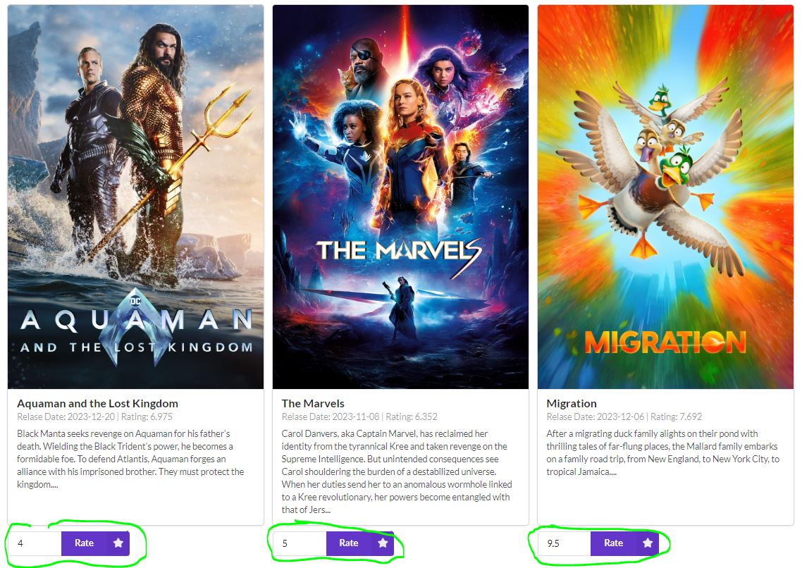
</div>

3. You can do the same for television shows. Click the 'TV Shows' tab on the top. This will navigate you to the TV Show section. Note that sometimes the link to a certain TV show is broken, and its image and info won't display.

<div style="display: flex; justify-content: center;">
    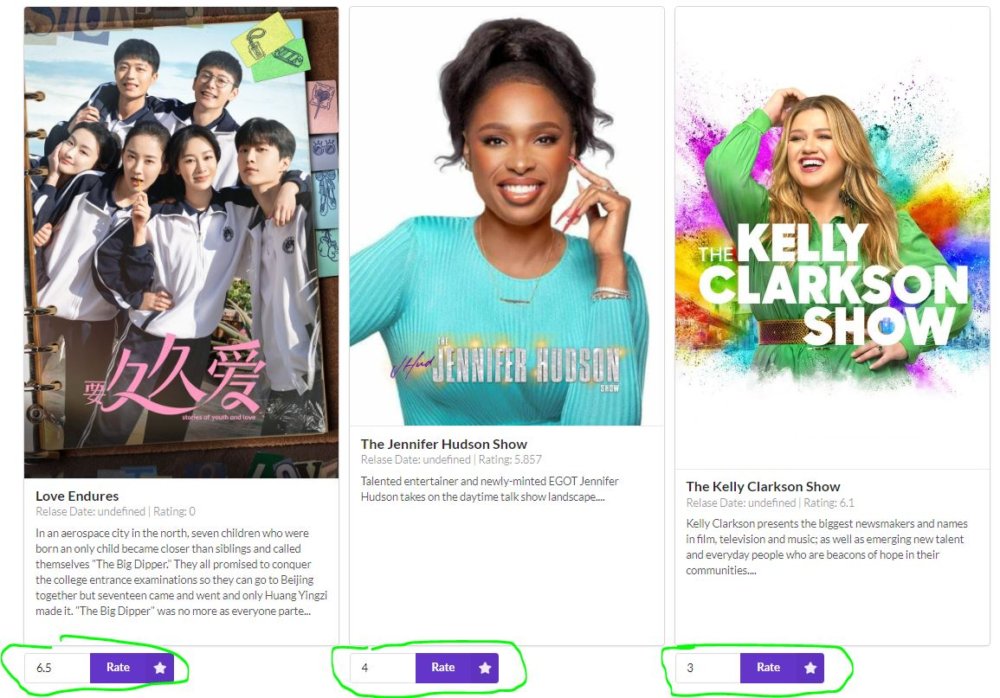
</div>

4. After rating the movie, select the 'Rated' tab on the top left. It will take you to the 'Rated Movies' section. Note that sometimes the link to a certain movie is broken, and its image and info won't display.

<div style="display: flex; justify-content: center;">
    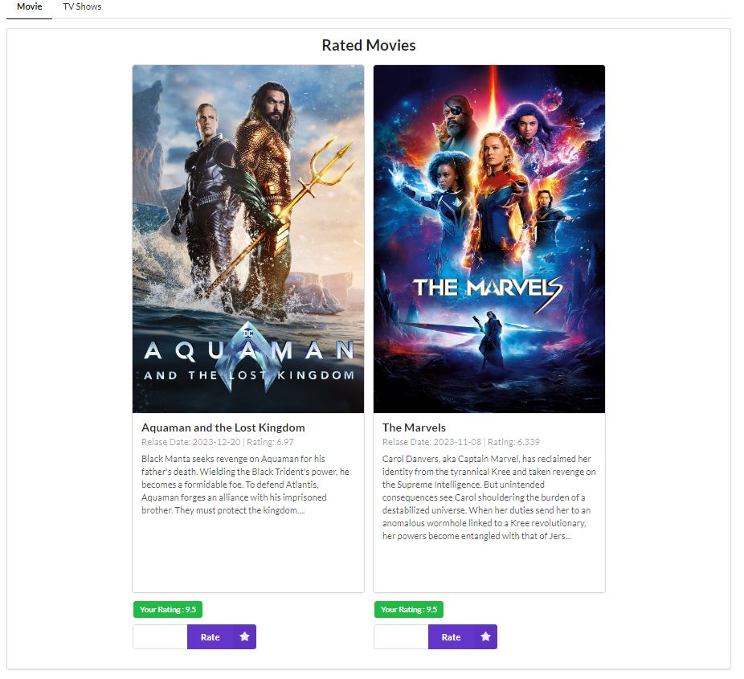
</div>

5. If you click on the image of the movie, it will take you to another page that will show you the details of the movie.

<div style="display: flex; justify-content: center;">
    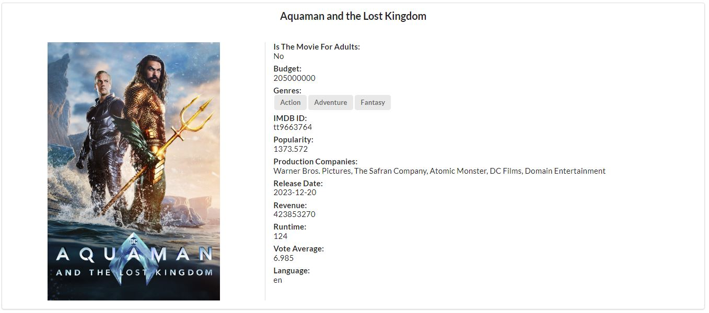
</div>

6. You can do the same for the TV show after rating it. Select "Rated" on the top left corner. Afterward, select the "TV Shows" tab inside the "Rated" page. This will display all the shows you rated. Note that sometimes the link to a certain show is broken, and its image and info won't display.

<div style="display: flex; justify-content: center;">
    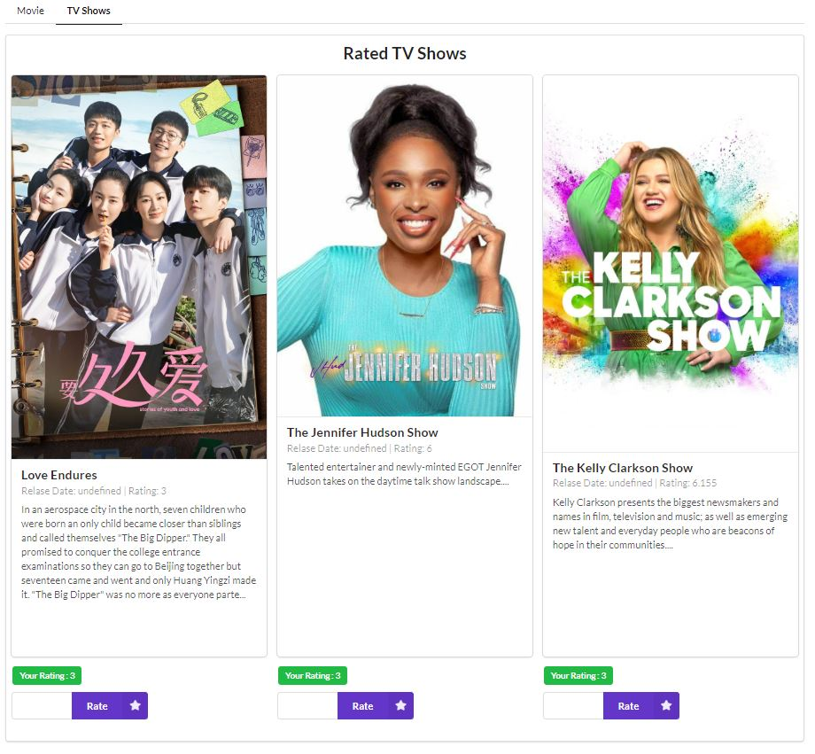
</div>

7. If you click on the image of the show, it will take you to another page that will show you the details of the show.

<div style="display: flex; justify-content: center;">
    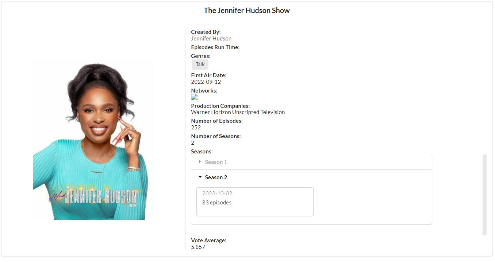
</div>

8. When you are finished, you can select the 'Logout' tab in the top right corner to log out. This will end your session. The next time you log back in, everything will be refreshed.

<div style="display: flex; justify-content: center;">
    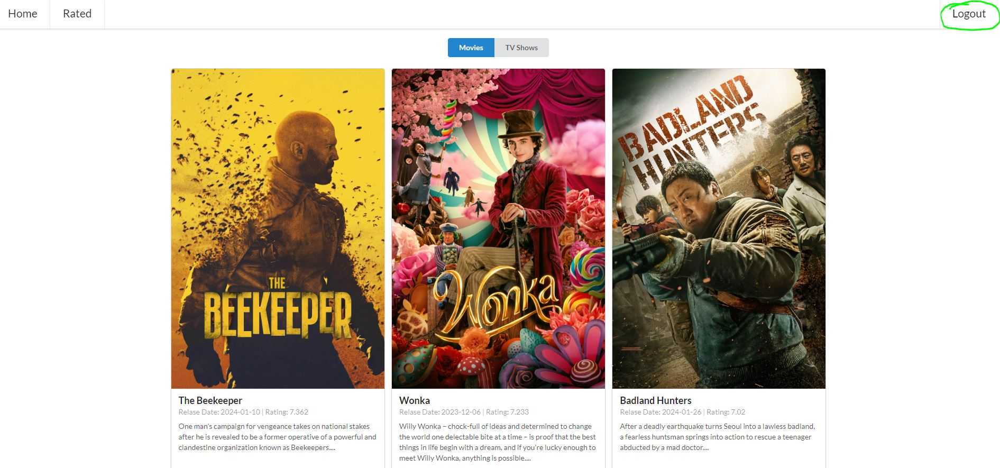
</div>

We hope you enjoy the app! Have a great day!
